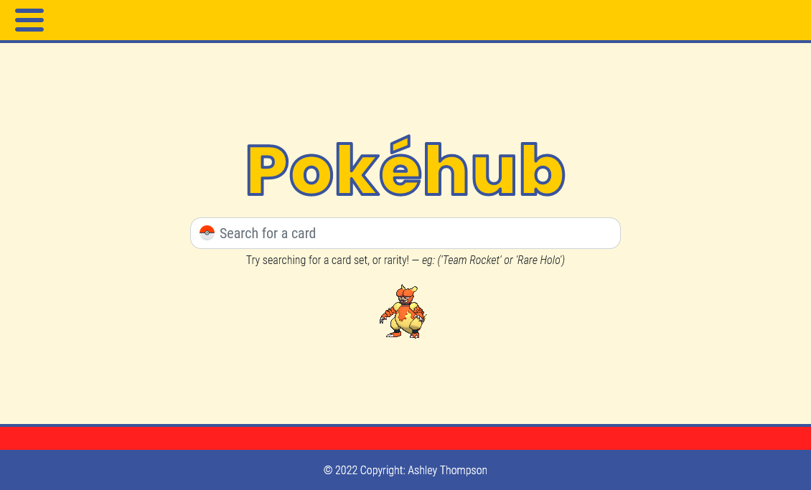
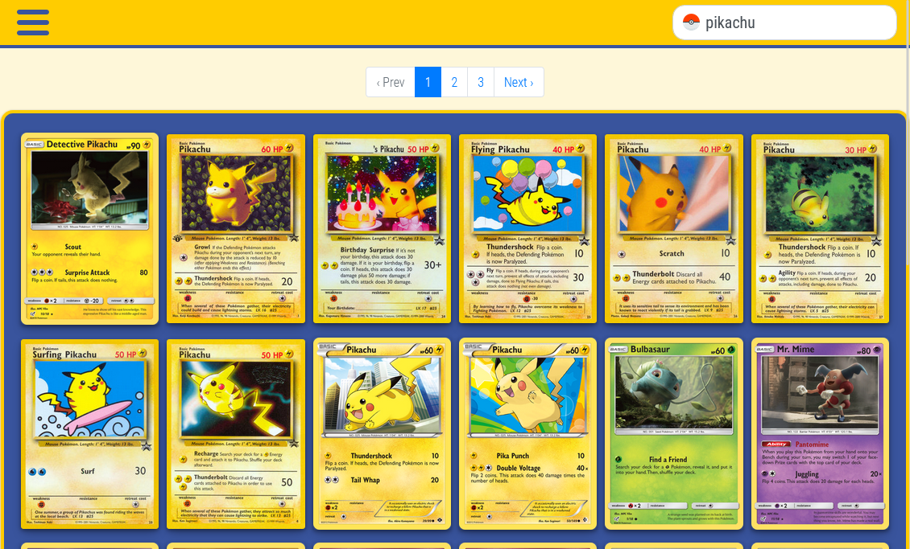

<h1 align="center">
  <a href="https://pokemon-marketplace-at2022.herokuapp.com/">
    Pokémon Marketplace
  </a>
</h1>

<div align="center">
  <a href="https://github.com/FluroAsh" target="_blank">
     
  </a>

  <a href="https://twitter.com/intent/follow?screen_name=ashleygthompson" target="_blank">
    
  </a>

  <a href="https://www.linkedin.com/in/ashley-thompson-dev/" target="_blank">
    
  </a>
</div>

## About the Project
Pokéhub is a passion of love, as-well as journey into learning Rails. The core of this application is to bring together the love for Pokémon trading cards with those that love the hobby of collecting them, giving a place for others to exchange cards in a fun, novel and visually engaging way.

This isn't a final product by any means, and likely will be recreated or overhaulted in the future.

#### Home Screen


#### Search Page


## Installation
To install **Pokémon Marketplace** you can either:
1.  Download the repository as a `ZIP` file, and unpack it into your local environment
2.  Clone the repo `git@github.com:FluroAsh/spotifree.git` with the **Git CLI** command in your terminal, ensuring that this is inside your local envrionment.

> Ensure that you are using >= `Ruby version 2.7.5`, Rails >= 6.1.4.6 as-well as have Postgres installed in your local environment.

For first time installation begin by running installing the current `NPM` dependencies that are found in the [package.json](https://github.com/FluroAsh/pokemon-marketplace/blob/main/package.json) file by running: 

```bash
> npm install
```

Please note that this application makes use of `Bootstrap version 4`, later versions cause unexpected issues. If you are still having problems, try executing:

```bash
> npm install boostrap@4 jquery popper.js
```

### Rails Setup
To get the `Rails` server up and running you'll need to run the following in your CLI:

```bash
> bundle install
> rails db:create
> rails db:migrate
> rails db:seed # this will take a few minutes
```

Once this is completed you should have a full list (5000) cards seeded into your local database with the name: `pokemon_marketplace_development`.

## Further configuration
For more advanced fine tuning the application such as the Stripe functionality, and S3 storage refer below.

### Amazon S3 Setup

In order to configure your own S3 storage you'll need to create your own credentials file (delete the existing one) and then execute:

```bash
EDITOR='code --wait' rails credentials:edit
```

This will bring you to the credentials file where you will need to provide your `access key` for Amazon's S3 storage, as-well as your `secret access key`.

Within the `storage.yml` file located in the `config` folder, you will also need to change the name of the S3 bucket from `pokemon-marketplace-at2022`:

```yml
amazon:
  service: S3
  access_key_id: <%= Rails.application.credentials.dig(:aws, :access_key_id) %>
  secret_access_key: <%= Rails.application.credentials.dig(:aws, :secret_access_key) %>
  region: ap-southeast-2
  bucket: pokemon-marketplace-at2022 # <-- your chosen bucket name
```

Once this is completed you should be able to successfully create user profile avatars on signup, as-well as change existing ones with the current user.

### Stripe
To get [Stripe](https://stripe.com/docs/api?lang=ruby) running you'll also need to provide your API key in the credentials file, this should look something like: 

```yml
stripe:
  secret_key: 'sk_test_4eC39HqLyjWDarjtT1zdp7dc' # example key
```

You can get an API key by registering with [Stripe](https://stripe.com/en-au) and accessing the developers section in their dashboard under 'API keys'.

The `stripe.rb` intializer file is already set up to look for this key in the credentials file.

### Ultrahook 
UltraHook makes it super easy to connect public webhook endpoints with development environments. 

To set this up you can navigate to [Ultrahook's website](https://www.ultrahook.com/faq) where the process has been thoroughly documented. 

However, it's worth noting that you will need to create the Webhook via Stripe's developer dashboard, and create a `checkout.session.completed` event/endpoint with the associated webhook URL provided by Ultrahook. 

This step is purely for local development so it can reroute requests from the Stripe endpoint to your local server, though you will also need to create an event endpoint for any given address should you decide to host it on an external web server.


## Contact

If you would like to get in touch, collaborate or contribute you can reach me via email or my socials *(above)*
- <a href="mailto:workashleythompson@gmail.com">workashleythompson@gmail.com</a>